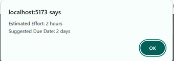

# TaskFlow - Smart Task & Project Manager

A full-stack task and project management application built using the MERN stack. The application allows users to manage boards and tasks efficiently using a Kanban-style interface with AI-powered effort and due date suggestions.

---

## 🚀 Features

### Authentication

- User Registration
- User Login
- JWT Authentication
- Protected Routes
- Logout Functionality

### Boards / Projects

- Create Board
- Rename Board
- Delete Board
- Dashboard with all boards

### Tasks

- Create Task
- Edit Task
- Delete Task
- Task Status Management
  - To Do
  - In Progress
  - Done

- Priority Management
- Due Date Management
- Estimated Effort
- Priority Filter

### AI Feature

- Smart Due-Date / Effort Estimate
- Google Gemini API Integration
- Backend-only API calls for security
- Graceful fallback if AI service fails

### UI/UX

- Responsive Design
- Loading Spinner
- Error Handling
- Delete Confirmation Dialog

---

# 🛠️ Tech Stack

## Frontend

- React.js
- React Router DOM
- Axios
- Tailwind CSS

## Backend

- Node.js
- Express.js
- JWT Authentication
- bcryptjs

## Database

- MongoDB Atlas
- Mongoose

## AI

- Google Gemini API (gemini-1.5-flash / gemini-2.0-flash)

---

# 📂 Project Structure

client/
├── src/
│ ├── components/
│ ├── pages/
│ ├── context/
│ └── services/

server/
├── controllers/
├── middleware/
├── models/
├── routes/
└── server.js

---

# ⚙️ Installation

## Clone Repository

```bash
git clone YOUR_GITHUB_LINK
cd task-manager
```

---

## Backend Setup

```bash
cd server
npm install
npm run dev
```

Runs on:

```bash
http://localhost:5000
```

---

## Frontend Setup

```bash
cd client
npm install
npm run dev
```

Runs on:

```bash
http://localhost:5173
```

---

# 🔐 Environment Variables

Create `.env` inside server folder.

```env
PORT=5000
MONGO_URI=your_mongodb_connection_string
JWT_SECRET=your_secret_key
GEMINI_API_KEY=your_gemini_api_key
```

---

# 🤖 AI Feature

This project uses the Google Gemini API to estimate:

- Estimated effort required to complete a task
- Suggested due date

The frontend sends the task title and description to the backend. The backend securely calls Gemini API and returns the AI-generated suggestion.

The API key is stored securely inside `.env` and never exposed to the browser.

---

# 📌 API Endpoints

## Authentication

| Method | Endpoint            | Description   |
| ------ | ------------------- | ------------- |
| POST   | /api/users/register | Register User |
| POST   | /api/users/login    | Login User    |

---

## Boards

| Method | Endpoint        | Description  |
| ------ | --------------- | ------------ |
| GET    | /api/boards     | Get Boards   |
| POST   | /api/boards     | Create Board |
| PUT    | /api/boards/:id | Rename Board |
| DELETE | /api/boards/:id | Delete Board |

---

## Tasks

| Method | Endpoint       | Description |
| ------ | -------------- | ----------- |
| GET    | /api/tasks     | Get Tasks   |
| POST   | /api/tasks     | Create Task |
| PUT    | /api/tasks/:id | Update Task |
| DELETE | /api/tasks/:id | Delete Task |

---

## AI

| Method | Endpoint        | Description          |
| ------ | --------------- | -------------------- |
| POST   | /api/ai/suggest | Generate AI Estimate |

---

# 📸 Screenshots

Add screenshots here:

- Login Page
- Register Page
- Dashboard
- Board Page
- Mobile View

---

# 🌐 Live Demo

Frontend:

```text
Add Vercel Link Here
```

Backend:

```text
Add Render/Railway Link Here
```

---

# 🧪 Test Credentials

```text
Email:
Password:
```

---

# 🚧 Known Limitations

- Drag and Drop is not implemented.
- Dark Mode is not implemented.
- No collaboration between users.

---

# 🔮 Future Improvements

- Drag and Drop Tasks
- Task Search
- Analytics Dashboard
- Notifications
- Board Sharing and Collaboration
- Activity Logs

---

# 👩‍💻 Developed By

Gauri Khandelwal

B.Tech Information Technology

Poornima College of Engineering

GitHub:(https://github.com/khandelwalgauri)

## Screenshots

### Login Page


### Register Page


### Dashboard


### Board Page


### AI Feature


